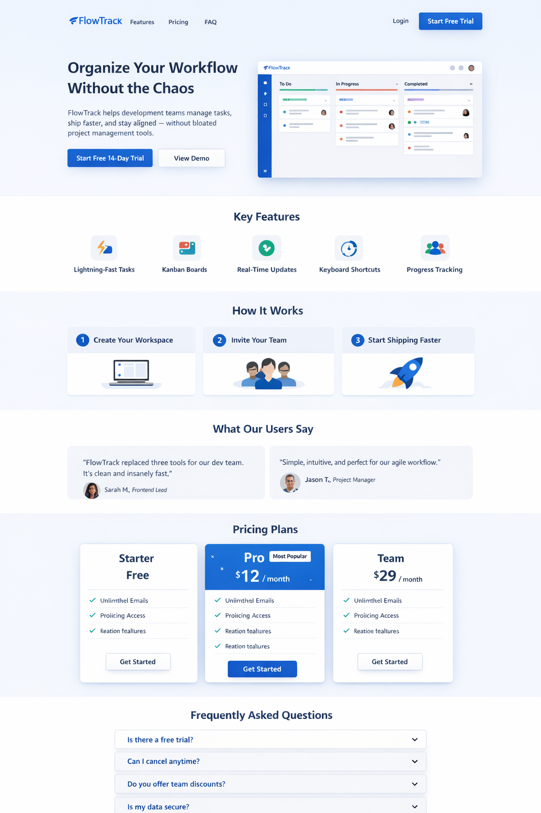

# Flow Track
A SaaS landing page project designed to demonstrate proficiency in Bootstrap, responsive design, and modern web development practices. The goal is to create a polished, professional marketing website for a fictional task management tool called FlowTrack.

### Project Type
A marketing website for a fictional SaaS product.

### What Is The Product?
**_FlowTrack_** is a simple task management tool built for developers and small teams who want:

* Clean task organization
* Minimal UI (no clutter)
* Kanban-style workflow
* Quick keyboard shortcuts
* Team collaboration

Think: “lightweight version of Jira or Trello for dev teams.”

My job is to build the **_marketing website_** that sells this product. Not the app itself, just the landing page that convinces users to sign up.

## Project Objective
Create a modern SaaS landing page that:

* _Clearly communicates product value_
* _Looks professional_
* _Is fully responsive_
* _Uses Bootstrap components properly_
* _Could realistically convert users_

## Visual Direction
Sample of the desired outcome:

